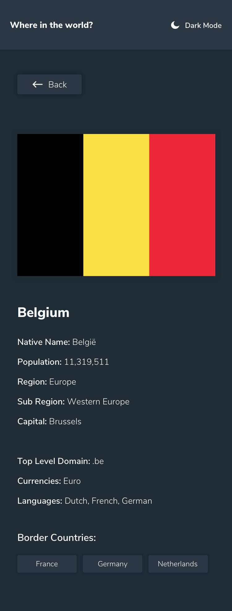

# REST Countries API with Color Theme Switcher




## Overview

This project is a solution to the **REST Countries API with Color Theme Switcher** challenge from Frontend Mentor.

The application allows users to browse countries from a local JSON dataset, search by country name, filter countries by region, navigate to a detailed information page, move between neighboring countries, and switch between light and dark themes.

The project focuses on building a clean React application with reusable components, client-side routing, and global theme management.

---

## Features

- Browse all countries
- Search countries by name
- Filter countries by region
- View detailed information about each country
- Navigate through border countries
- Responsive layout for different screen sizes
- Light / Dark mode
- Persistent theme using Local Storage

---

## Built With

- React
- React Router DOM
- Vite
- Tailwind CSS
- Context API
- CSS Variables
- JavaScript (ES6+)

---

## Folder Structure

```text
src
│
├── components
│   ├── Header.jsx
│   ├── SearchBar.jsx
│   ├── RegionFilter.jsx
│   ├── CountryGrid.jsx
│   └── CountryCard.jsx
│
├── pages
│   ├── HomePage.jsx
│   └── CountryDetails.jsx
│
├── services
│   └── countries.js
│
├── context
│   └── ThemeContext.jsx
│
├── App.jsx
├── main.jsx
└── index.css
```

### Directory Description

- **components** → Reusable UI components.
- **pages** → Main application pages.
- **services** → Handles data fetching and helper functions.
- **context** → Global theme state management.
- **App.jsx** → Defines application routes.
- **main.jsx** → React application entry point.
- **index.css** → Global styles and CSS variables.

---

## Installation

Clone the repository

```bash
git clone https://github.com/Ali-Shameli/REST-Countries-API
```

Install dependencies

```bash
npm install
```

Run the development server

```bash
npm run dev
```

Open your browser at

```text
http://localhost:5173
```

---

## What I Learned

During this project I improved my understanding of:

- Component-based architecture in React
- React Router and dynamic routing
- Organizing a scalable project structure
- Separating business logic into a service layer
- Managing global state using Context API
- Creating reusable UI components
- Implementing light and dark themes with CSS Variables
- Working with asynchronous data
- Searching and filtering derived state
- Building responsive layouts using Tailwind CSS

---

## Future Improvements

Some possible improvements for this project include:

- Add loading skeletons instead of simple loading text.
- Improve accessibility (ARIA attributes and keyboard navigation).
- Add animations for page transitions.
- Replace the local JSON file with a real API.

---

## Author

GitHub:
https://github.com/Ali-Shameli